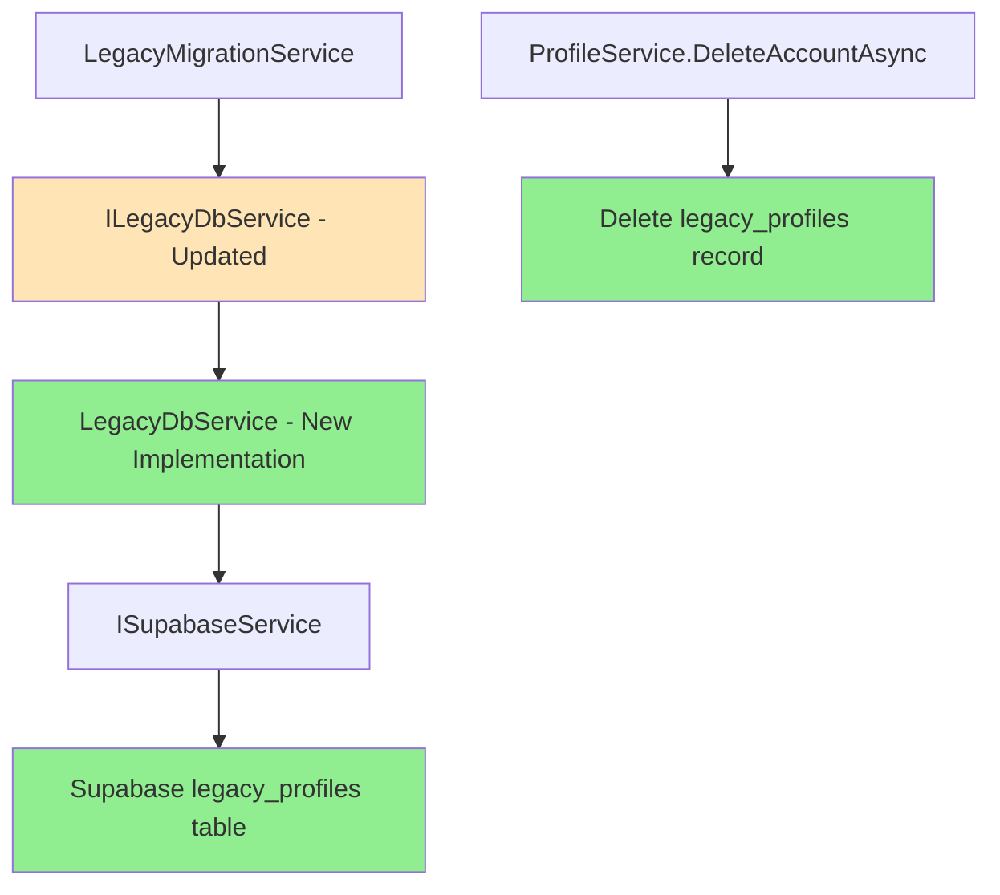

# Design Document

## Overview

This design replaces the MSSQL-based legacy data access with a new service that queries the pre-populated legacy_profiles table in Supabase. The migration will update the existing interfaces and services to work with the new data structure, eliminating the external MSSQL dependency. Account deletion will be enhanced to include legacy data cleanup.

## Steering Document Alignment

### Technical Standards (tech.md)
- Follows existing Supabase data access patterns using ISupabaseService and QueryAsync
- Maintains feature folder organization with services in Profile/Services
- Uses existing dependency injection configuration
- Preserves async/await patterns for all I/O operations
- Follows nullable reference type patterns

### Project Structure (structure.md)
- Updated service class in apps/api/TrendWeight/Features/Profile/Services/
- New database model in apps/api/TrendWeight/Infrastructure/DataAccess/Models/
- Test coverage in TrendWeight.Tests project
- No changes to frontend code required

## Code Reuse Analysis

### Existing Components to Leverage
- **ISupabaseService**: Existing Supabase data access layer with QueryAsync pattern
- **LegacyMigrationService**: Update to work with new data structure
- **ProviderLinkService**: Existing service for managing provider links
- **SourceDataService**: Existing service for storing measurement data
- **ProfileService**: Account deletion logic to be extended
- **DbSourceData**: Pattern for handling List<RawMeasurement> in Supabase models

### Integration Points
- **Supabase Database**: New table model integrates with existing Postgrest patterns
- **Dependency Injection**: Replace LegacyDbService registration in ServiceCollectionExtensions
- **Account Deletion**: Extends existing deletion cascade to include legacy_profiles table
- **Migration Flow**: Updates existing profile/measurement migration logic for new data structure

## Architecture

The design follows a service replacement pattern where the new LegacyDbService queries Supabase instead of MSSQL, with updated interfaces to better match the new data structure.



## Components and Interfaces

### Component 1: DbLegacyProfile Model
- **Purpose:** Supabase model for the legacy_profiles table
- **Interfaces:** BaseModel (Supabase.Postgrest.Models)
- **Dependencies:** Supabase.Postgrest attributes
- **Reuses:** Same pattern as DbSourceData for List<RawMeasurement>
- **Location:** Infrastructure/DataAccess/Models/DbLegacyProfile.cs

### Component 2: Updated ILegacyDbService Interface
- **Purpose:** Updated interface to better match new data structure
- **Changes:** Return combined profile data with measurements from single table
- **Location:** Features/Profile/Services/ILegacyDbService.cs

### Component 3: LegacyDbService (New Implementation)
- **Purpose:** Implementation of ILegacyDbService using Supabase
- **Interfaces:** ILegacyDbService (updated)
- **Dependencies:** ISupabaseService, ILogger
- **Reuses:** QueryAsync pattern from ProviderLinkService and SourceDataService
- **Location:** Features/Profile/Services/LegacyDbService.cs (replace existing)

### Component 4: Enhanced ProfileService.DeleteAccountAsync
- **Purpose:** Extended account deletion to include legacy data
- **Interfaces:** Existing IProfileService
- **Dependencies:** ISupabaseService (for legacy_profiles deletion)
- **Reuses:** Existing deletion pattern with cascade handling

### Component 5: Updated LegacyMigrationService
- **Purpose:** Work with new data structure from single table
- **Interfaces:** ILegacyMigrationService (minimal updates)
- **Dependencies:** ILegacyDbService (updated interface)
- **Reuses:** Core migration logic with adjustments for combined data

## Data Models

### DbLegacyProfile
```csharp
[Table("legacy_profiles")]
public class DbLegacyProfile : BaseModel
{
    [Column("email")]
    public string Email { get; set; } = string.Empty;
    
    [Column("username")]
    public string? Username { get; set; }
    
    [Column("first_name")]
    public string? FirstName { get; set; }
    
    [Column("use_metric")]
    public bool? UseMetric { get; set; }
    
    [Column("start_date")]
    public DateTime? StartDate { get; set; }
    
    [Column("goal_weight")]
    public decimal? GoalWeight { get; set; }
    
    [Column("planned_pounds_per_week")]
    public decimal? PlannedPoundsPerWeek { get; set; }
    
    [Column("day_start_offset")]
    public int? DayStartOffset { get; set; }
    
    [Column("private_url_key")]
    public string? PrivateUrlKey { get; set; }
    
    [Column("device_type")]
    public string? DeviceType { get; set; }
    
    [Column("refresh_token")]
    public string? RefreshToken { get; set; }
    
    [Column("measurements")]
    public List<RawMeasurement>? Measurements { get; set; }
}
```

### Updated ILegacyDbService Interface
```csharp
public interface ILegacyDbService
{
    /// <summary>
    /// Finds a legacy profile with measurements by email
    /// </summary>
    Task<LegacyProfile?> FindLegacyDataByEmailAsync(string email);
}

public class LegacyProfile
{
    // Profile fields
    public string Email { get; set; } = string.Empty;
    public string? FirstName { get; set; }
    public bool UseMetric { get; set; }
    public DateTime? StartDate { get; set; }
    public decimal? GoalWeight { get; set; }
    public decimal? PlannedPoundsPerWeek { get; set; }
    public int? DayStartOffset { get; set; }
    public string? PrivateUrlKey { get; set; }
    public string? DeviceType { get; set; }
    public string? RefreshToken { get; set; }
    
    // Measurements already in correct format
    public List<RawMeasurement> Measurements { get; set; } = new List<RawMeasurement>();
}
```

### Data Format Notes
- Email is the primary lookup key (not a Supabase primary key)
- Measurements handled same as DbSourceData - Supabase SDK handles JSON serialization
- Weights in measurements are already converted to kg
- Measurement format matches source_data table exactly (Date, Time, Weight, FatRatio)

## Error Handling

### Error Scenarios
1. **Legacy Profile Not Found**
   - **Handling:** Return null, no migration performed
   - **User Impact:** Normal account creation flow continues

2. **Supabase Connection Failure**
   - **Handling:** Log error, return null
   - **User Impact:** Migration skipped, user can retry later

3. **Null Measurements Field**
   - **Handling:** Use empty list
   - **User Impact:** Profile migrated without historical data

4. **Account Deletion Legacy Data Failure**
   - **Handling:** Log error, continue with other deletions
   - **User Impact:** Account deleted but legacy data may remain (manual cleanup required)

## Testing Strategy

### Unit Testing
- Mock ISupabaseService for LegacyDbService tests
- Test null/empty data handling
- Test measurement data pass-through
- Test account deletion with legacy data
- Verify profile data mapping

### Manual Testing
- Migrate a test account with legacy data
- Verify measurements appear correctly
- Delete account and verify legacy data removal
- Test with various data scenarios (null fields, empty measurements, etc.)

## Implementation Details

### Key Implementation Notes

1. **No Unit Conversion Required**: Weights in legacy_profiles are already in kg
2. **Direct Transfer**: Measurements can be directly assigned to SourceData
3. **Email-based Lookup**: Use QueryAsync with email filter
4. **Null-Safe Operations**: Handle nullable fields throughout
5. **Service Registration**: Replace LegacyDbService with new implementation in DI
6. **Single Query**: Get both profile and measurements in one database call

### Migration Logic Simplification
```csharp
// New approach - direct from combined data
var legacyData = await _legacyDbService.FindLegacyDataByEmailAsync(email);
if (legacyData == null) return null;

// Direct transfer of measurements (already in correct format)
if (legacyData.Measurements.Any())
{
    var sourceData = new List<SourceData>
    {
        new SourceData
        {
            Source = "legacy",
            LastUpdate = DateTime.UtcNow,
            Measurements = legacyData.Measurements
        }
    };
    
    await _sourceDataService.UpdateSourceDataAsync(userId, sourceData);
}
```

### Account Deletion Enhancement
```csharp
// In ProfileService.DeleteAccountAsync, after deleting profile:
var legacyProfiles = await _supabaseService.QueryAsync<DbLegacyProfile>(q =>
    q.Filter("email", Operator.Equals, userEmail));

foreach (var legacyProfile in legacyProfiles)
{
    await _supabaseService.DeleteAsync(legacyProfile);
}
```

## Configuration Changes

### Items to Remove
- AppOptions.LegacyDbConnectionString property
- Microsoft.Data.SqlClient NuGet package
- Dapper NuGet package (if not used elsewhere)
- MSSQL environment variables in all environments
- Old LegacyDbService implementation
- Old LegacyProfile and LegacyMeasurement models in LegacyModels.cs

### Items to Add/Update
- New LegacyDbService implementation (replacing old one)
- DbLegacyProfile model class
- Updated ILegacyDbService interface
- New LegacyProfile class (replacing old one)
- Unit tests for new service

### Items to Modify
- ServiceCollectionExtensions: Update service registration (same class name)
- LegacyMigrationService: Use new combined data structure
- ProfileService: Add legacy data deletion